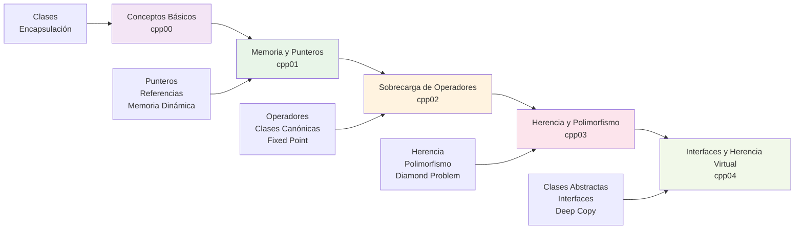

# 📘 C++ Piscine – 42 Barcelona
[](https://wakatime.com/badge/user/640df229-0fc5-4d67-92ba-90084661c6d4/project/4e87dcd9-48ea-4e2c-8699-6dd9acda4429)

Este repositorio contiene mis ejercicios y apuntes personales de la piscina de C++ en [42 Barcelona](https://42barcelona.com/).

## 📚 Módulos del Proyecto

| Módulo | Descripción | Conceptos Clave | Estado |
|--------|-------------|-----------------|--------|
| **[cpp00](cpp00/README.md)** | Conceptos básicos y Phonebook | Clases, encapsulación, arrays estáticos | ✅ Completo |
| **[cpp01](cpp01/README.md)** | Punteros, clases y composición | Punteros, referencias, memoria dinámica | ✅ Completo |
| **[cpp02](cpp02/README.md)** | Sobrecarga del operador | Operadores, clases canónicas, Fixed Point | ✅ Completo |
| **[cpp03](cpp03/README.md)** | Herencia y polimorfismo | Herencia, virtual, Diamond Problem | ✅ Completo |
| **[cpp04](cpp04/README.md)** | Interfaces y herencia virtual | Clases abstractas, interfaces, deep copy | ✅ Completo |

## 🎯 Objetivos del Proyecto

Este proyecto de piscina C++ está diseñado para enseñar los conceptos fundamentales de programación orientada a objetos en C++:

- **Encapsulación**: Ocultar datos internos y exponer interfaces limpias
- **Herencia**: Reutilizar código y crear jerarquías de clases
- **Polimorfismo**: Comportamiento dinámico basado en tipos
- **Gestión de memoria**: Punteros, referencias, new/delete
- **Sobrecarga de operadores**: Personalizar el comportamiento de operadores
- **Clases abstractas**: Definir interfaces y contratos

## 🛠️ Tecnologías Utilizadas

- **C++98/03**: Estándar utilizado en 42
- **Makefile**: Sistema de compilación
- **CMake**: Sistema de construcción alternativo
- **Git**: Control de versiones
- **Valgrind**: Detección de memory leaks

## 📁 Estructura del Proyecto

```
cpp_piscine_1/
├── cpp00/          # Conceptos básicos
├── cpp01/          # Punteros y memoria
├── cpp02/          # Sobrecarga de operadores
├── cpp03/          # Herencia y polimorfismo
├── cpp04/          # Interfaces y herencia virtual
├── assets/         # Diagramas y recursos
├── structs/        # Ejemplos de estructuras
└── teoria/         # Material teórico
```

## 🚀 Cómo Compilar y Ejecutar

Cada módulo tiene su propio sistema de compilación. Consulta el README individual de cada módulo para instrucciones específicas.

### Compilación General
```bash
# Para compilar todos los módulos
make -f Makefile_pro

# Para compilar un módulo específico
cd cpp00/ex00 && make
```

## 📊 Diagramas y Recursos

- **Diagramas UML**: Disponibles en la carpeta `assets/`
- **Diagramas Mermaid**: Incluidos en cada README individual
- **Ejemplos de código**: Documentados con comentarios detallados

### 🏗️ Arquitectura General del Proyecto

```mermaid
graph TD
    A[C++ Piscine Project] --> B[cpp00 - Fundamentos]
    A --> C[cpp01 - Memoria y Punteros]
    A --> D[cpp02 - Sobrecarga de Operadores]
    A --> E[cpp03 - Herencia y Polimorfismo]
    A --> F[cpp04 - Interfaces y Herencia Virtual]
    
    B --> B1[ex00 - Megaphone]
    B --> B2[ex01 - Phonebook]
    
    C --> C1[ex00 - Punteros y Referencias]
    C --> C2[ex01 - Zombie Horde]
    C --> C3[ex02 - Human vs Weapon]
    C --> C4[ex03 - Sed]
    C --> C5[ex04 - Harl]
    
    D --> D1[ex00 - Clase Fixed]
    D --> D2[ex01 - Operadores Aritméticos]
    D --> D3[ex02 - Incremento/Decremento]
    D --> D4[ex03 - Pruebas]
    
    E --> E1[ex00 - ClapTrap]
    E --> E2[ex01 - ScavTrap]
    E --> E3[ex02 - FragTrap]
    E --> E4[ex03 - DiamondTrap]
    
    F --> F1[ex00 - Animal Base]
    F --> F2[ex01 - Deep Copy]
    F --> F3[ex02 - Abstract Animal]
    F --> F4[ex03 - Materia System]
    
    style A fill:#e1f5fe
    style B fill:#f3e5f5
    style C fill:#e8f5e8
    style D fill:#fff3e0
    style E fill:#fce4ec
    style F fill:#f1f8e9
```



### 🔄 Progresión de Conceptos



## 🎓 Conceptos Aprendidos

### cpp00 - Fundamentos
- Sintaxis básica de C++
- Clases y objetos
- Encapsulación
- Arrays estáticos

### cpp01 - Memoria y Punteros
- Gestión de memoria dinámica
- Punteros vs referencias
- Constructores y destructores
- Composición de clases

### cpp02 - Operadores
- Sobrecarga de operadores
- Clases canónicas
- Fixed Point Arithmetic
- Operadores de comparación

### cpp03 - Herencia
- Herencia simple y múltiple
- Polimorfismo
- Funciones virtuales
- Diamond Problem

### cpp04 - Interfaces
- Clases abstractas
- Interfaces puras
- Deep vs Shallow Copy
- Virtual Inheritance

## 📝 Notas de Desarrollo

- Todos los ejercicios siguen las normas de 42
- Código documentado con comentarios explicativos
- Ejemplos de uso incluidos en cada ejercicio
- Tests y validaciones implementadas

## 🤝 Contribuciones

Este es un proyecto personal de aprendizaje. Si encuentras errores o tienes sugerencias, ¡no dudes en contactarme!

---

> `Made with 💙 at 42BCN`  
> `© Ana Medina – 42 Barcelona` 


