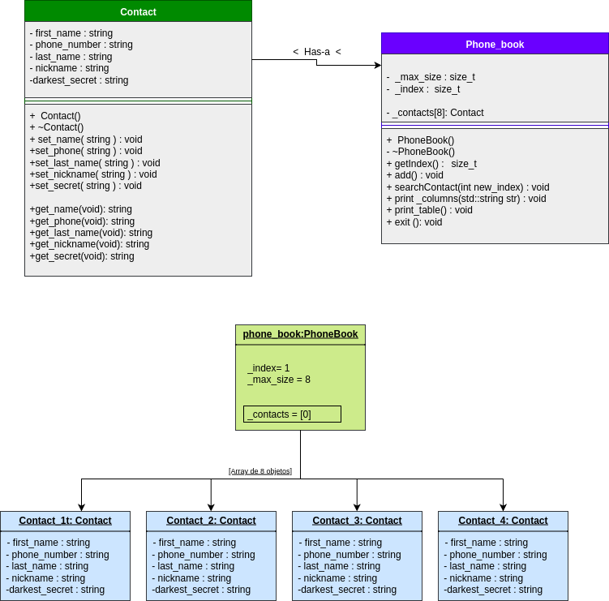

# 📘 C++ Module 01 – 42 Barcelona

Este repositorio contiene mis ejercicios y apuntes personales del **módulo 01 de C++** de la piscina en [42 Barcelona](https://42barcelona.com/).

Aquí encontrarás:
- Diagramas UML para visualizar la estructura de clases.
- Explicaciones teóricas por ejercicio.
- Buenas prácticas y tips clave.

---

## 📌 Diagrama general del proyecto

---

## 📦 ex00 – Pointers and References

### 🎯 Objetivo:
- Entender la diferencia entre punteros (`*`) y referencias (`&`) en C++.
- Ver cómo acceden a la misma dirección de memoria.

### 🧠 Conceptos clave:
- Un **puntero** puede cambiar y puede ser `nullptr`.
- Una **referencia** debe estar inicializada y no puede cambiar de objeto.
- Ambas permiten modificar el valor original al que apuntan.

---

## 📦 ex01 – Zombie class

### 🎯 Objetivo:
- Practicar el uso de clases, memoria dinámica y funciones miembro.

### 🧠 Conceptos clave:
- Crear objetos en el **stack** y en el **heap** (`new`, `delete`).
- Implementar constructores, métodos (`announce`) y destructores.
- Importancia del destructor para liberar memoria dinámica.

### ✔️ Buenas prácticas:
- Si usas `new`, asegúrate de usar `delete`.
- El destructor debe anunciar la destrucción del objeto (para seguimiento).

---

## 📦 ex02 – HumanA vs HumanB y Weapon

### 🎯 Objetivo:
- Comprender la diferencia entre componer clases con **referencias** vs **punteros**.
- Entender cuándo usar cada uno.

### 👤 HumanA:
- Recibe un `Weapon&` (referencia) en su constructor.
- El arma debe existir **antes** y **no puede cambiarse ni eliminarse**.
- No puede existir sin un arma.

### 👤 HumanB:
- Tiene un `Weapon*` (puntero) que se puede **añadir más tarde** o dejar vacío.
- Puede cambiar de arma en cualquier momento con `setWeapon`.
- Puede existir sin arma.

### 🧠 Conceptos clave:
- Una **referencia** es más segura si el objeto siempre debe tener un arma.
- Un **puntero** es más flexible, pero requiere comprobaciones (`nullptr`).
- Este ejercicio demuestra **diferencias de diseño en composición de clases**.

---

## 📦 ex03 – *(En construcción)*

> Este ejercicio puede variar según la versión del módulo.  
> Algunos ejemplos incluyen el uso de `const`, copia de objetos, acceso a miembros privados, etc.

---

## 📦 ex04 – Sed is for losers

### 🎯 Objetivo:
- Crear un programa que lea un archivo de texto y reemplace todas las ocurrencias de una palabra por otra.

### 🧠 Conceptos clave:
- Uso de **streams en C++**: `ifstream`, `ofstream`.
- Manipulación de **strings** con `find`, `replace`, `substr`.
- Crear un nuevo archivo de salida con el contenido modificado.

### ✔️ Buenas prácticas:
- Comprobar que el archivo original se abrió correctamente.
- Validar que los argumentos no estén vacíos.
- Asegurarse de no entrar en bucles infinitos al reemplazar.

---

## 📦 ex05 – Harl complains

### 🎯 Objetivo:
- Crear una clase `Harl` que tenga diferentes niveles de queja (`DEBUG`, `INFO`, `WARNING`, `ERROR`) y ejecute una función distinta para cada nivel.

### 🧠 Conceptos clave:
- Uso de funciones miembro privadas que representan cada nivel.
- Implementar un método público `complain(string level)` que actúe como **dispatcher**.
- Uso de arrays de punteros a funciones miembro.

### ✔️ Buenas prácticas:
- Mantener limpio el código evitando múltiples `if-else`.
- Usar `typedef` o `using` para punteros a funciones para mejor legibilidad.

---

## 📦 ex06 – Harl filter (opcional)

### 🎯 Objetivo:
- Filtrar las quejas de `Harl` según un nivel dado, imprimiendo solo desde ese nivel hacia arriba.

### 🧠 Conceptos clave:
- Implementar un sistema de **prioridades** de logging.
- Filtrado de los niveles usando un array de strings y un índice de comparación.
- El nivel introducido por el usuario determina a partir de qué quejas se imprimen.

### ✔️ Buenas prácticas:
- Manejar niveles desconocidos con un mensaje por defecto.
- Mantener una estructura clara y escalable por si se añaden más niveles.

---

## 🧠 Conclusión general del módulo

Este módulo refuerza conceptos fundamentales de C++:

- 📍 Diferencias entre stack y heap
- 🔁 Gestión de memoria manual
- 🧷 Punteros vs referencias
- 🧩 Composición de clases
- 🛠️ Constructores, destructores y const correctness

---

## 🖋️ Créditos

> 📍 Proyecto realizado durante la piscina de C++ en [42 Barcelona](https://42barcelona.com/)  
> 👩‍💻 Autora: **Ana Medina**  
> 🌊 Piscinera de 42  
> 📅 Año: 2025

---

## 🧭 Marca de agua (opcional)

> `Ana Medina @ 42 Barcelona`  
> `Made with 💙 at 42BCN`  
> `© Ana Medina – 42 Barcelona`

