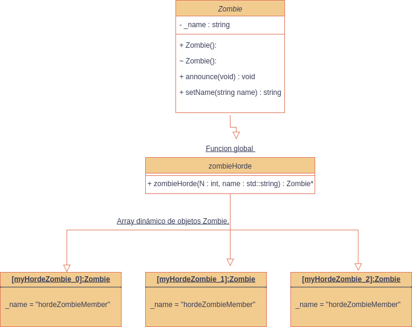
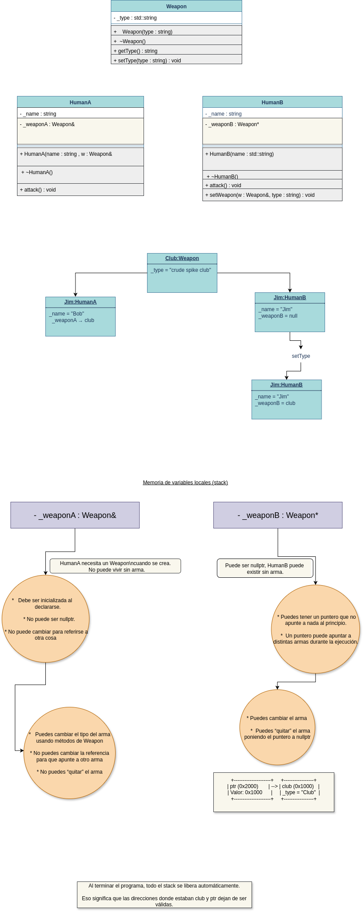
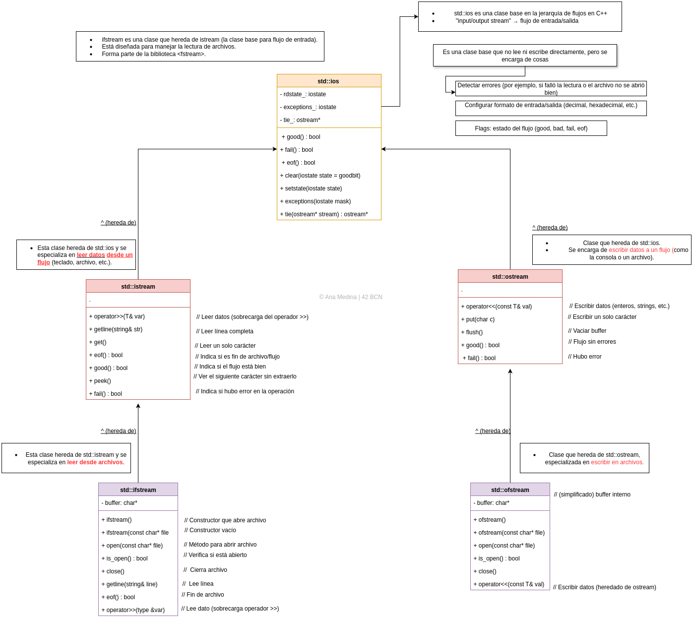
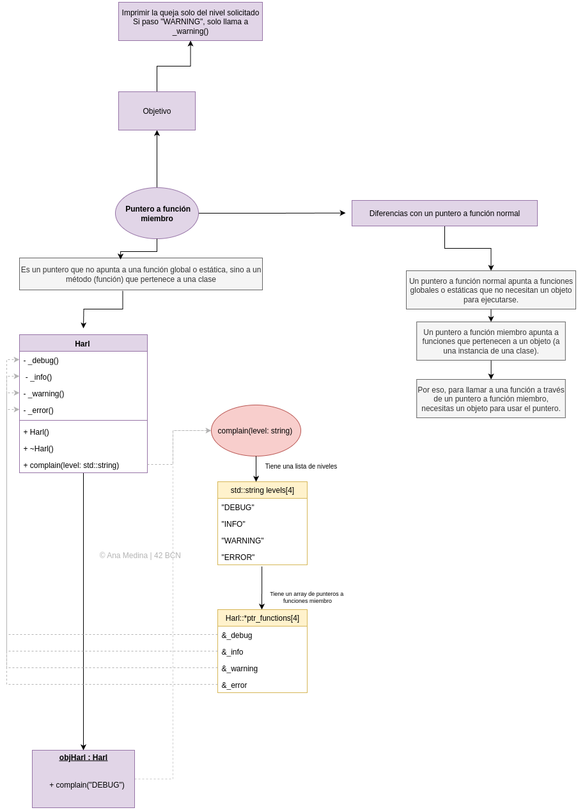

# 📦 cpp01 – Punteros, Clases y Composición

Este módulo profundiza en la gestión de memoria, punteros, referencias y la composición de clases en C++.

## 🎯 Objetivos del Módulo

- Entender la diferencia entre punteros y referencias
- Aprender gestión de memoria dinámica (heap vs stack)
- Implementar composición de clases
- Dominar constructores y destructores

## 📚 Ejercicios

### 📦 ex00 – Pointers and References

**Objetivo**: Entender la diferencia entre punteros (`*`) y referencias (`&`) en C++.

**Conceptos clave**:
- Un **puntero** puede cambiar y puede ser `nullptr`
- Una **referencia** debe estar inicializada y no puede cambiar de objeto
- Ambas permiten modificar el valor original al que apuntan

**Archivos**:
- `main.cpp` - Demostración de punteros y referencias
- `newZombie.cpp` - Función que crea zombie en heap
- `randomChump.cpp` - Función que crea zombie en stack
- `Zombie.cpp` - Implementación de la clase Zombie
- `Zombie.hpp` - Declaración de la clase Zombie

**Compilación**:
```bash
cd ex00
make
./brainz
```

### 📦 ex01 – Zombie Horde

**Objetivo**: Crear una horda de zombies en memoria dinámica.

**Conceptos clave**:
- Uso de arrays dinámicos con punteros
- Gestión de memoria con `new[]` y `delete[]`
- Llamada a métodos de cada objeto en la horda

**Diagrama UML**:


**Compilación**:
```bash
cd ex01
make
./zombieHorde
```

### 📦 ex02 – HumanA vs HumanB y Weapon

**Objetivo**: Comprender la diferencia entre componer clases con **referencias** vs **punteros**.

**Conceptos clave**:
- **HumanA**: Recibe un `Weapon&` (referencia) en su constructor
- **HumanB**: Tiene un `Weapon*` (puntero) que se puede añadir más tarde
- Una **referencia** es más segura si el objeto siempre debe tener un arma
- Un **puntero** es más flexible, pero requiere comprobaciones (`nullptr`)

**Diagrama UML**:


**Compilación**:
```bash
cd ex02
make
./human
```

### 📦 ex03 – Sed is for losers

**Objetivo**: Crear un programa que lea un archivo de texto y reemplace todas las ocurrencias de una palabra por otra.

**Conceptos clave**:
- Uso de **streams en C++**: `ifstream`, `ofstream`
- Manipulación de **strings** con `find`, `replace`, `substr`
- Crear un nuevo archivo de salida con el contenido modificado

**Diagrama UML**:


**Compilación**:
```bash
cd ex03
make
./sed "old_word" "new_word" "filename"
```

### 📦 ex04 – Harl complains

**Objetivo**: Crear una clase `Harl` que tenga diferentes niveles de queja y ejecute una función distinta para cada nivel.

**Conceptos clave**:
- Uso de funciones miembro privadas que representan cada nivel
- Implementar un método público `complain(string level)` que actúe como **dispatcher**
- Uso de arrays de punteros a funciones miembro

**Diagrama UML**:


**Compilación**:
```bash
cd ex04
make
./harl "DEBUG"
```

### 📦 ex05 – Harl filter (opcional)

**Objetivo**: Implementar un filtro de niveles de queja para Harl.

**Compilación**:
```bash
cd ex05
make
./harl
```

## 🧠 Conceptos Aprendidos

### Gestión de Memoria
```cpp
// Stack (automático)
Zombie stackZombie("StackZombie");

// Heap (manual)
Zombie* heapZombie = new Zombie("HeapZombie");
delete heapZombie; // ¡Importante liberar memoria!
```

### Punteros vs Referencias
```cpp
// Puntero - puede ser nullptr
int* ptr = nullptr;
ptr = &value;

// Referencia - debe estar inicializada
int& ref = value;
```

### Composición de Clases
```cpp
class HumanA {
private:
    Weapon& weapon; // Referencia - más segura
public:
    HumanA(Weapon& w) : weapon(w) {}
};

class HumanB {
private:
    Weapon* weapon; // Puntero - más flexible
public:
    void setWeapon(Weapon* w) { weapon = w; }
};
```

## 🛠️ Tecnologías Utilizadas

- **C++98**: Estándar utilizado en 42
- **Makefile**: Sistema de compilación
- **STL**: `std::string`, `std::ifstream`, `std::ofstream`
- **Gestión de memoria**: `new`, `delete`, `new[]`, `delete[]`

## 📁 Estructura de Archivos

```
cpp01/
├── ex00/
│   ├── main.cpp
│   ├── newZombie.cpp
│   ├── randomChump.cpp
│   ├── Zombie.cpp
│   ├── Zombie.hpp
│   └── Makefile
├── ex01/
│   ├── main.cpp
│   ├── Zombie.cpp
│   ├── Zombie.hpp
│   ├── ZombieHorde.cpp
│   └── Makefile
├── ex02/
│   ├── main.cpp
│   └── Makefile
├── ex03/
│   ├── HumanA.cpp
│   ├── HumanA.hpp
│   ├── HumanB.cpp
│   ├── HumanB.hpp
│   ├── Weapon.cpp
│   ├── Weapon.hpp
│   ├── main.cpp
│   └── Makefile
├── ex04/
│   ├── main.cpp
│   ├── test.txt
│   ├── test.txt.replace
│   └── Makefile
├── ex05/
│   ├── Harl.cpp
│   ├── Harl.hpp
│   ├── main.cpp
│   └── Makefile
├── ex06/
│   ├── Harl.cpp
│   ├── Harl.hpp
│   ├── main.cpp
│   └── Makefile
└── README.md
```

## 🚀 Cómo Ejecutar

### Ejercicio 00 - Punteros y Referencias
```bash
cd cpp01/ex00
make
./brainz
```

### Ejercicio 01 - Zombie Horde
```bash
cd cpp01/ex01
make
./zombieHorde
```

### Ejercicio 02 - Human vs Weapon
```bash
cd cpp01/ex02
make
./human
```

### Ejercicio 03 - Sed
```bash
cd cpp01/ex03
make
./sed "old" "new" "file.txt"
```

### Ejercicio 04 - Harl
```bash
cd cpp01/ex04
make
./harl "DEBUG"
```

## 📝 Notas Importantes

- **Gestión de memoria**: Siempre liberar la memoria asignada con `new`
- **Referencias vs Punteros**: Elegir según el caso de uso
- **Composición**: Entender cuándo usar referencias vs punteros
- **Streams**: Manejo correcto de archivos de entrada y salida

## 🎓 Conceptos Clave del Módulo

1. **Memoria dinámica**: Heap vs Stack
2. **Punteros**: Gestión manual de memoria
3. **Referencias**: Acceso seguro a objetos
4. **Composición**: Relaciones entre clases
5. **Streams**: Entrada/salida de archivos
6. **Funciones miembro**: Organización del código

---

> `Made with 💙 at 42BCN`  
> `© Ana Medina – 42 Barcelona`
