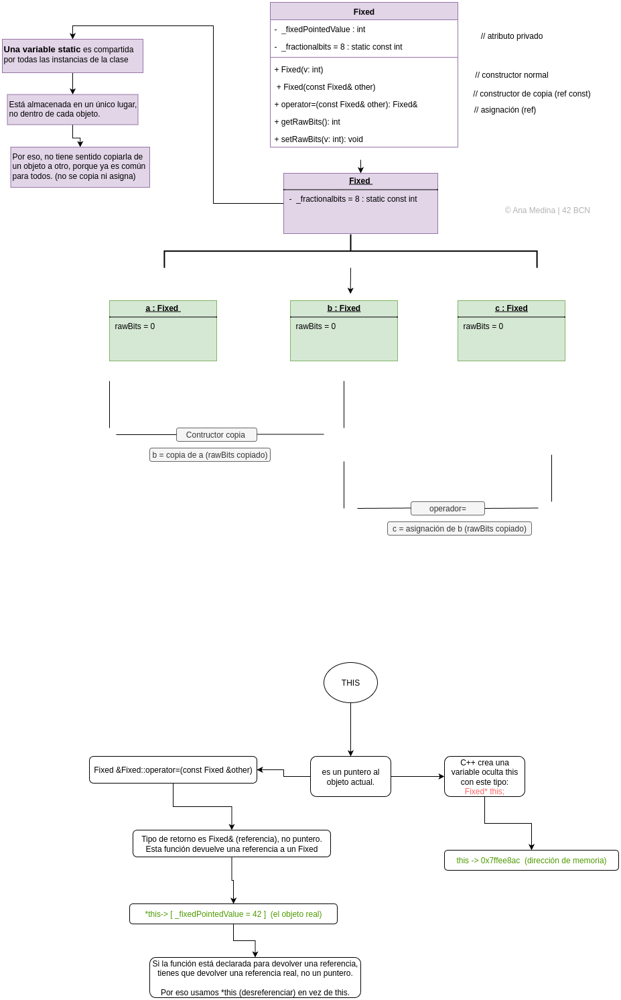
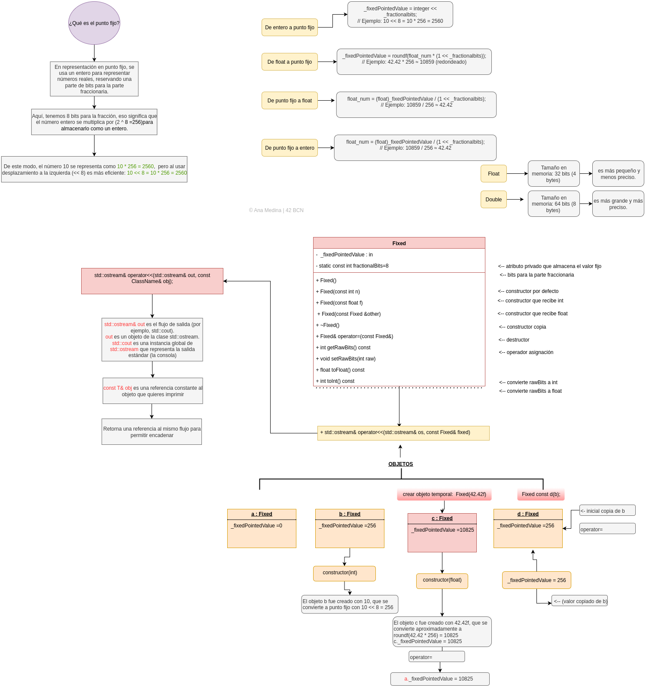
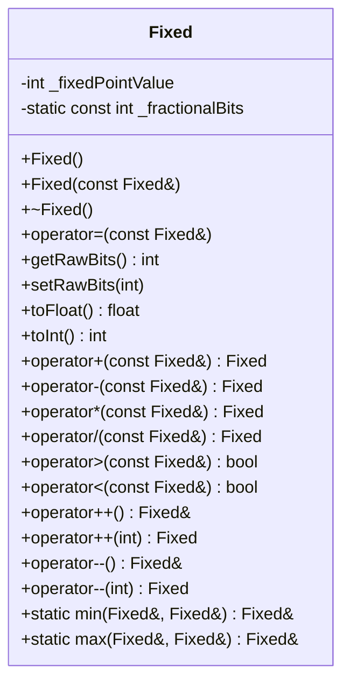
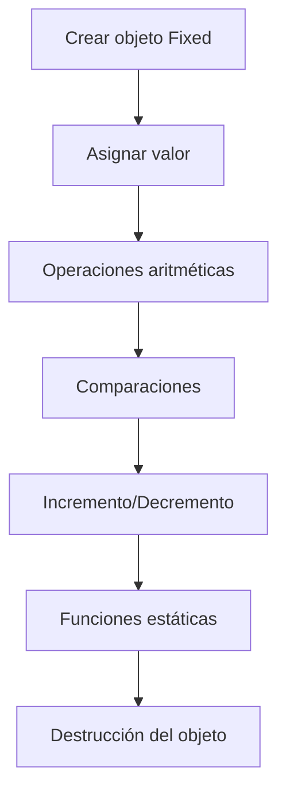

# 📦 cpp02 – Sobrecarga del Operador

Este módulo se enfoca en la sobrecarga de operadores, las clases canónicas y la aritmética de punto fijo en C++.

## 🎯 Objetivos del Módulo

- Dominar la sobrecarga de operadores en C++
- Implementar las cuatro funciones canónicas de una clase
- Entender la aritmética de punto fijo
- Aprender sobre operadores de comparación y aritméticos

## 📚 Ejercicios

### 📦 ex00 – Clase Fixed

**Objetivo**: Practicar el uso de clases en C++ con atributos privados y públicos.

**Conceptos clave**:
- Declaración e implementación de constructores y destructor
- Sobrecarga del operador de asignación (`operator=`)
- Métodos getters y setters para acceder a datos privados
- Uso de variables miembro privadas para mantener estado interno

**Diagrama UML**:


**Compilación**:
```bash
cd ex00
make
./fixed
```

### 📦 ex01 – Implementación de operadores y métodos adicionales

**Objetivo**: Completar la clase `Fixed` con operadores y funciones para manipular datos.

**Conceptos clave**:
- Sobrecarga de operadores en C++
- Conversión entre tipos (`float`, `int`) y la clase propia
- Mejorar la interfaz de la clase para un uso más intuitivo

**Diagrama UML**:


**Compilación**:
```bash
cd ex01
make
./fixed
```

### 📦 ex02 – Operadores de incremento/decremento y funciones estáticas

**Objetivo**: Implementar operadores de incremento y decremento en la clase `Fixed`.

**Conceptos clave**:
- Operadores sobrecargados para pre y post incremento/decremento
- Funciones estáticas que actúan sobre objetos sin necesidad de instancia
- Uso correcto de referencias y constantes para eficiencia y seguridad

**Compilación**:
```bash
cd ex02
make
./fixed
```

### 📦 ex03 – Pruebas y uso de la clase Fixed

**Objetivo**: Crear programas de prueba para validar todas las funcionalidades implementadas en la clase `Fixed`.

**Conceptos clave**:
- Escritura de programas que crean objetos, usan operadores y métodos
- Observación y comparación de resultados esperados y reales
- Corrección de errores y mejora iterativa del código

**Compilación**:
```bash
cd ex03
make
./fixed
```

## 🧠 Conceptos Aprendidos

### Clases Canónicas
```cpp
class Fixed {
private:
    int _fixedPointValue;
    static const int _fractionalBits = 8;

public:
    // 1. Constructor por defecto
    Fixed();
    
    // 2. Constructor de copia
    Fixed(const Fixed& other);
    
    // 3. Operador de asignación
    Fixed& operator=(const Fixed& other);
    
    // 4. Destructor
    ~Fixed();
};
```

### Sobrecarga de Operadores
```cpp
// Operadores aritméticos
Fixed operator+(const Fixed& other) const;
Fixed operator-(const Fixed& other) const;
Fixed operator*(const Fixed& other) const;
Fixed operator/(const Fixed& other) const;

// Operadores de comparación
bool operator>(const Fixed& other) const;
bool operator<(const Fixed& other) const;
bool operator>=(const Fixed& other) const;
bool operator<=(const Fixed& other) const;
bool operator==(const Fixed& other) const;
bool operator!=(const Fixed& other) const;

// Operadores de incremento/decremento
Fixed& operator++();    // Pre-incremento
Fixed operator++(int);  // Post-incremento
Fixed& operator--();    // Pre-decremento
Fixed operator--(int); // Post-decremento
```

### Aritmética de Punto Fijo
```cpp
// Conversión entre tipos
float toFloat(void) const;
int toInt(void) const;

// Operadores de inserción
friend std::ostream& operator<<(std::ostream& os, const Fixed& fixed);
```

### Funciones Estáticas
```cpp
// Funciones estáticas para comparar objetos
static Fixed& min(Fixed& a, Fixed& b);
static const Fixed& min(const Fixed& a, const Fixed& b);
static Fixed& max(Fixed& a, Fixed& b);
static const Fixed& max(const Fixed& a, const Fixed& b);
```

## 🛠️ Tecnologías Utilizadas

- **C++98**: Estándar utilizado en 42
- **Makefile**: Sistema de compilación
- **Aritmética de punto fijo**: Representación de números decimales
- **Sobrecarga de operadores**: Personalización del comportamiento

## 📁 Estructura de Archivos

```
cpp02/
├── ex00/
│   ├── Fixed.cpp
│   ├── Fixed.hpp
│   ├── main.cpp
│   └── Makefile
├── ex01/
│   ├── Fixed.cpp
│   ├── Fixed.hpp
│   ├── main.cpp
│   └── Makefile
├── ex02/
│   ├── Fixed.cpp
│   ├── Fixed.hpp
│   ├── main.cpp
│   └── Makefile
├── ex03/
│   ├── Fixed.cpp
│   ├── Fixed.hpp
│   ├── main.cpp
│   └── Makefile
└── README.md
```

## 🚀 Cómo Ejecutar

### Ejercicio 00 - Clase Fixed Básica
```bash
cd cpp02/ex00
make
./fixed
```

### Ejercicio 01 - Operadores Aritméticos
```bash
cd cpp02/ex01
make
./fixed
```

### Ejercicio 02 - Incremento/Decremento
```bash
cd cpp02/ex02
make
./fixed
```

### Ejercicio 03 - Pruebas Completas
```bash
cd cpp02/ex03
make
./fixed
```

## 📝 Notas Importantes

- **Clases canónicas**: Implementar las 4 funciones básicas
- **Sobrecarga de operadores**: Mantener la semántica esperada
- **Punto fijo**: Entender la representación de números decimales
- **Funciones estáticas**: No requieren instancia de la clase
- **Referencias**: Usar `const` cuando sea apropiado

## 🎓 Conceptos Clave del Módulo

1. **Clases canónicas**: Constructor, destructor, copia, asignación
2. **Sobrecarga de operadores**: Personalizar el comportamiento
3. **Aritmética de punto fijo**: Representación de decimales
4. **Funciones estáticas**: Métodos que no requieren instancia
5. **Operadores de inserción**: Personalizar la salida con `<<`
6. **Referencias constantes**: Eficiencia y seguridad

## 🔍 Diagramas Mermaid

### Jerarquía de la Clase Fixed


### Flujo de Operaciones


---

> `Made with 💙 at 42BCN`  
> `© Ana Medina – 42 Barcelona`
