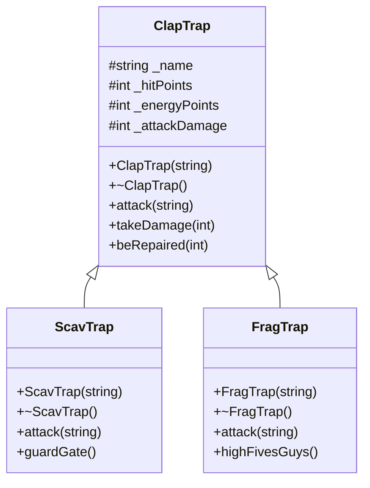
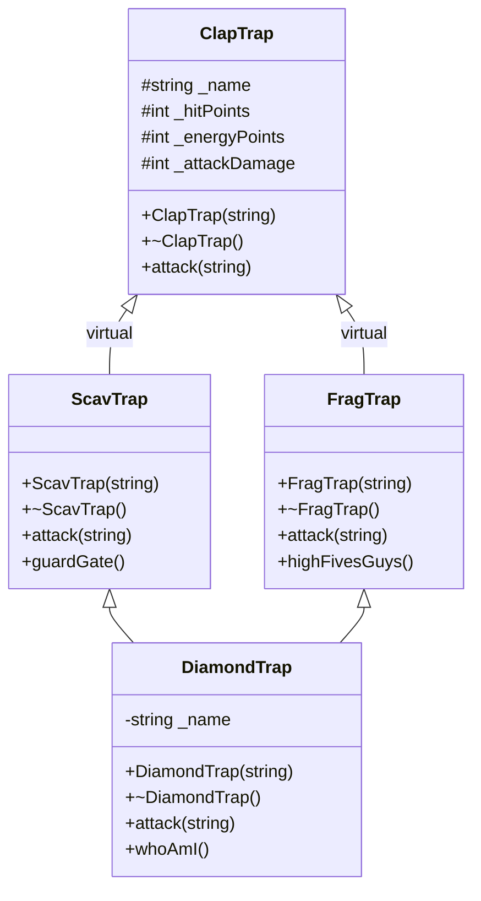
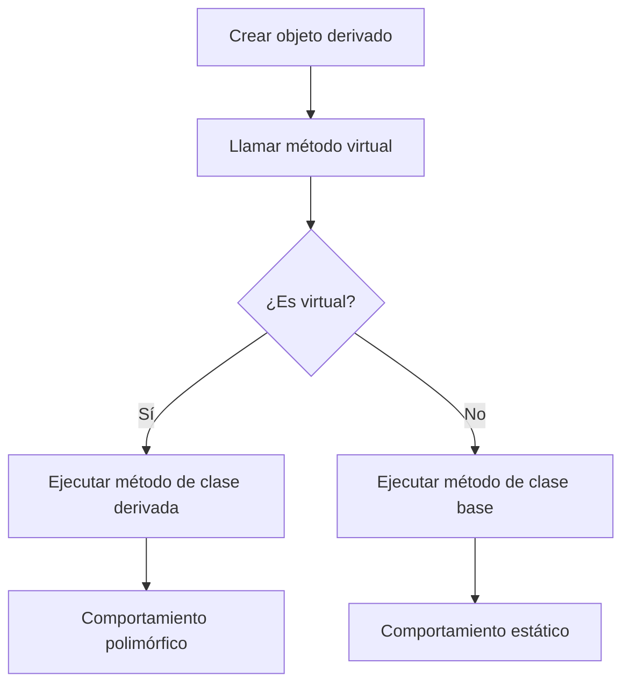

# 📦 cpp03 – Herencia y Polimorfismo

Este módulo introduce los conceptos de herencia, polimorfismo y el problema del diamante en C++.

## 🎯 Objetivos del Módulo

- Entender la herencia simple y múltiple
- Dominar el polimorfismo con funciones virtuales
- Resolver el problema del diamante
- Implementar jerarquías de clases complejas

## 📚 Ejercicios

### 📦 ex00 – ClapTrap

**Objetivo**: Crear una clase base `ClapTrap` con atributos y métodos básicos.

**Conceptos clave**:
- Clases base con atributos protegidos
- Constructores y destructores
- Métodos de ataque y reparación
- Gestión de puntos de vida y energía

**Compilación**:
```bash
cd ex00
make
./claptrap
```

### 📦 ex01 – ScavTrap

**Objetivo**: Crear una clase `ScavTrap` que herede de `ClapTrap`.

**Conceptos clave**:
- Herencia simple
- Sobrescritura de métodos
- Constructores de herencia
- Nuevos métodos específicos de la clase derivada

**Compilación**:
```bash
cd ex01
make
./scavtrap
```

### 📦 ex02 – FragTrap

**Objetivo**: Crear una clase `FragTrap` que herede de `ClapTrap`.

**Conceptos clave**:
- Herencia simple
- Métodos virtuales
- Polimorfismo
- Gestión de energía específica

**Compilación**:
```bash
cd ex02
make
./fragtrap
```

### 📦 ex03 – DiamondTrap

**Objetivo**: Crear una clase `DiamondTrap` que herede de `ScavTrap` y `FragTrap`.

**Conceptos clave**:
- Herencia múltiple
- Problema del diamante
- Resolución de ambigüedades
- Métodos específicos de la clase final

**Compilación**:
```bash
cd ex03
make
./diamondtrap
```

## 🧠 Conceptos Aprendidos

### Herencia Simple
```cpp
class ClapTrap {
protected:
    std::string _name;
    unsigned int _hitPoints;
    unsigned int _energyPoints;
    unsigned int _attackDamage;

public:
    ClapTrap(const std::string& name);
    virtual ~ClapTrap();
    void attack(const std::string& target);
    void takeDamage(unsigned int amount);
    void beRepaired(unsigned int amount);
};

class ScavTrap : public ClapTrap {
public:
    ScavTrap(const std::string& name);
    ~ScavTrap();
    void guardGate();
    void attack(const std::string& target); // Sobrescritura
};
```

### Herencia Múltiple
```cpp
class DiamondTrap : public ScavTrap, public FragTrap {
private:
    std::string _name;

public:
    DiamondTrap(const std::string& name);
    ~DiamondTrap();
    void whoAmI();
    void attack(const std::string& target); // Resolución de ambigüedad
};
```

### Polimorfismo
```cpp
// Función virtual en la clase base
virtual void attack(const std::string& target);

// Sobrescritura en clases derivadas
void ScavTrap::attack(const std::string& target) {
    // Implementación específica
}
```

### Problema del Diamante
```cpp
// Clase base virtual para evitar duplicación
class ClapTrap {
    // ...
};

class ScavTrap : virtual public ClapTrap {
    // ...
};

class FragTrap : virtual public ClapTrap {
    // ...
};

class DiamondTrap : public ScavTrap, public FragTrap {
    // Solo una instancia de ClapTrap
};
```

## 🛠️ Tecnologías Utilizadas

- **C++98**: Estándar utilizado en 42
- **Makefile**: Sistema de compilación
- **Herencia**: Simple y múltiple
- **Polimorfismo**: Funciones virtuales
- **Virtual inheritance**: Resolución del problema del diamante

## 📁 Estructura de Archivos

```
cpp03/
├── ex00/
│   ├── ClapTrap.cpp
│   ├── ClapTrap.hpp
│   ├── main.cpp
│   └── Makefile
├── ex01/
│   ├── ClapTrap.cpp
│   ├── ClapTrap.hpp
│   ├── ScavTrap.cpp
│   ├── ScavTrap.hpp
│   ├── main.cpp
│   └── Makefile
├── ex02/
│   ├── ClapTrap.cpp
│   ├── ClapTrap.hpp
│   ├── FragTrap.cpp
│   ├── FragTrap.hpp
│   ├── ScavTrap.cpp
│   ├── ScavTrap.hpp
│   ├── main.cpp
│   └── Makefile
├── ex03/
│   ├── ClapTrap.cpp
│   ├── ClapTrap.hpp
│   ├── DiamondTrap.cpp
│   ├── DiamondTrap.hpp
│   ├── FragTrap.cpp
│   ├── FragTrap.hpp
│   ├── ScavTrap.cpp
│   ├── ScavTrap.hpp
│   ├── main.cpp
│   └── Makefile
└── README.md
```

## 🚀 Cómo Ejecutar

### Ejercicio 00 - ClapTrap
```bash
cd cpp03/ex00
make
./claptrap
```

### Ejercicio 01 - ScavTrap
```bash
cd cpp03/ex01
make
./scavtrap
```

### Ejercicio 02 - FragTrap
```bash
cd cpp03/ex02
make
./fragtrap
```

### Ejercicio 03 - DiamondTrap
```bash
cd cpp03/ex03
make
./diamondtrap
```

## 📝 Notas Importantes

- **Herencia virtual**: Evita duplicación en herencia múltiple
- **Funciones virtuales**: Permiten polimorfismo
- **Destructores virtuales**: Importantes para herencia
- **Resolución de ambigüedades**: Especificar la clase base correcta
- **Constructores de herencia**: Llamar constructores de clases base

## 🎓 Conceptos Clave del Módulo

1. **Herencia simple**: Una clase base, una clase derivada
2. **Herencia múltiple**: Múltiples clases base
3. **Polimorfismo**: Comportamiento dinámico basado en tipos
4. **Problema del diamante**: Duplicación en herencia múltiple
5. **Virtual inheritance**: Solución al problema del diamante
6. **Funciones virtuales**: Comportamiento polimórfico

## 🔍 Diagramas Mermaid

### Jerarquía de Herencia Simple


### Herencia Múltiple (DiamondTrap)


### Flujo de Polimorfismo


---

> `Made with 💙 at 42BCN`  
> `© Ana Medina – 42 Barcelona`
