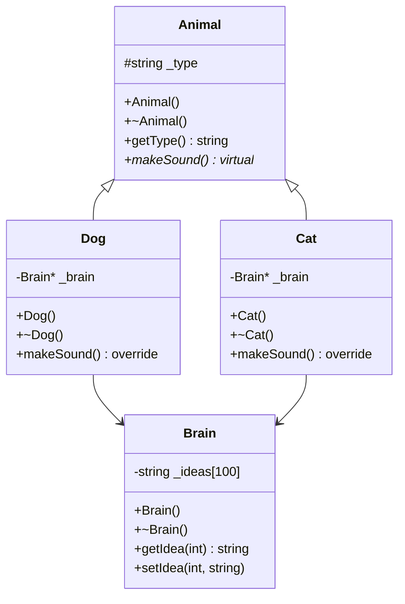
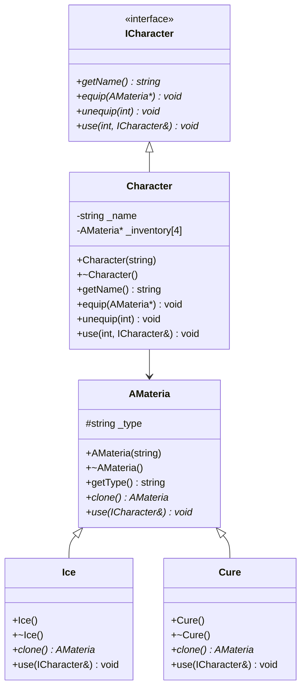
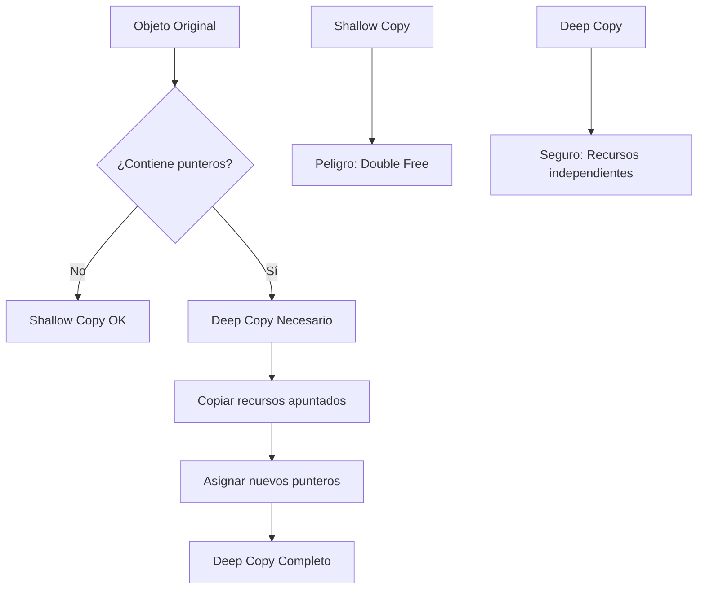

# 📦 cpp04 – Interfaces y Herencia Virtual

Este módulo introduce las clases abstractas, interfaces puras y el concepto de deep copy en C++.

## 🎯 Objetivos del Módulo

- Entender las clases abstractas y interfaces
- Implementar deep copy vs shallow copy
- Dominar la herencia virtual
- Crear sistemas de interfaces complejos

## 📚 Ejercicios

### 📦 ex00 – Animal Base Class

**Objetivo**: Crear una jerarquía de clases con `Animal` como clase base.

**Conceptos clave**:
- Clases base con métodos virtuales
- Herencia simple
- Polimorfismo básico
- Destructores virtuales

**Compilación**:
```bash
cd ex00
make
./animal
```

### 📦 ex01 – Deep Copy with Brain

**Objetivo**: Implementar deep copy en clases que contienen punteros.

**Conceptos clave**:
- Deep copy vs shallow copy
- Gestión de memoria en copias
- Destructores apropiados
- Constructores de copia

**Compilación**:
```bash
cd ex01
make
./deepcopy
```

### 📦 ex02 – Abstract Animal

**Objetivo**: Convertir `Animal` en una clase abstracta.

**Conceptos clave**:
- Clases abstractas
- Funciones virtuales puras
- Interfaces
- Polimorfismo puro

**Compilación**:
```bash
cd ex02
make
./abstract
```

### 📦 ex03 – Materia System

**Objetivo**: Crear un sistema de materias con interfaces.

**Conceptos clave**:
- Interfaces puras
- Clases abstractas
- Sistemas de herencia complejos
- Gestión de recursos

**Compilación**:
```bash
cd ex03
make
./materia
```

## 🧠 Conceptos Aprendidos

### Clases Abstractas
```cpp
class Animal {
protected:
    std::string _type;

public:
    Animal();
    virtual ~Animal();
    Animal(const Animal& other);
    Animal& operator=(const Animal& other);
    
    std::string getType() const;
    virtual void makeSound() const = 0; // Función virtual pura
};
```

### Deep Copy vs Shallow Copy
```cpp
class Dog : public Animal {
private:
    Brain* _brain;

public:
    Dog();
    Dog(const Dog& other); // Deep copy
    Dog& operator=(const Dog& other); // Deep copy
    ~Dog();
    
    void makeSound() const override;
};

// Deep copy implementation
Dog::Dog(const Dog& other) : Animal(other) {
    _brain = new Brain(*other._brain); // Copia profunda
}
```

### Interfaces Puras
```cpp
class ICharacter {
public:
    virtual ~ICharacter() {}
    virtual std::string const & getName() const = 0;
    virtual void equip(AMateria* m) = 0;
    virtual void unequip(int idx) = 0;
    virtual void use(int idx, ICharacter& target) = 0;
};

class IMateriaSource {
public:
    virtual ~IMateriaSource() {}
    virtual void learnMateria(AMateria*) = 0;
    virtual AMateria* createMateria(std::string const & type) = 0;
};
```

### Sistema de Materias
```cpp
class AMateria {
protected:
    std::string _type;

public:
    AMateria(std::string const & type);
    virtual ~AMateria();
    std::string const & getType() const;
    virtual AMateria* clone() const = 0;
    virtual void use(ICharacter& target);
};

class Ice : public AMateria {
public:
    Ice();
    virtual ~Ice();
    AMateria* clone() const;
    void use(ICharacter& target);
};
```

## 🛠️ Tecnologías Utilizadas

- **C++98**: Estándar utilizado en 42
- **Makefile**: Sistema de compilación
- **Clases abstractas**: Interfaces puras
- **Deep copy**: Gestión de memoria compleja
- **Polimorfismo**: Comportamiento dinámico

## 📁 Estructura de Archivos

```
cpp04/
├── ex00/
│   ├── Animal.cpp
│   ├── Animal.hpp
│   ├── Cat.cpp
│   ├── Cat.hpp
│   ├── Dog.cpp
│   ├── Dog.hpp
│   ├── WrongAnimal.cpp
│   ├── WrongAnimal.hpp
│   ├── WrongCat.cpp
│   ├── WrongCat.hpp
│   ├── main.cpp
│   └── Makefile
├── ex01/
│   ├── Animal.cpp
│   ├── Animal.hpp
│   ├── Brain.cpp
│   ├── Brain.hpp
│   ├── Cat.cpp
│   ├── Cat.hpp
│   ├── Dog.cpp
│   ├── Dog.hpp
│   ├── main.cpp
│   └── Makefile
├── ex02/
│   ├── AAnimal.cpp
│   ├── AAnimal.hpp
│   ├── Brain.cpp
│   ├── Brain.hpp
│   ├── Cat.cpp
│   ├── Cat.hpp
│   ├── Dog.cpp
│   ├── Dog.hpp
│   ├── main.cpp
│   └── Makefile
├── ex03/
│   ├── AMateria.cpp
│   ├── AMateria.hpp
│   ├── Character.cpp
│   ├── Character.hpp
│   ├── Cure.cpp
│   ├── Cure.hpp
│   ├── Ice.cpp
│   ├── Ice.hpp
│   ├── ICharacter.hpp
│   ├── IMateriaSource.hpp
│   ├── MateriaSource.cpp
│   ├── MateriaSource.hpp
│   ├── main.cpp
│   └── Makefile
└── README.md
```

## 🚀 Cómo Ejecutar

### Ejercicio 00 - Animal Base Class
```bash
cd cpp04/ex00
make
./animal
```

### Ejercicio 01 - Deep Copy
```bash
cd cpp04/ex01
make
./deepcopy
```

### Ejercicio 02 - Abstract Animal
```bash
cd cpp04/ex02
make
./abstract
```

### Ejercicio 03 - Materia System
```bash
cd cpp04/ex03
make
./materia
```

## 📝 Notas Importantes

- **Clases abstractas**: No se pueden instanciar directamente
- **Deep copy**: Copiar todos los recursos, no solo punteros
- **Interfaces puras**: Solo métodos virtuales puros
- **Destructores virtuales**: Importantes para herencia
- **Gestión de memoria**: Liberar todos los recursos asignados

## 🎓 Conceptos Clave del Módulo

1. **Clases abstractas**: No instanciables, solo herencia
2. **Interfaces puras**: Solo métodos virtuales puros
3. **Deep copy**: Copia completa de recursos
4. **Shallow copy**: Solo copia de punteros
5. **Polimorfismo**: Comportamiento dinámico
6. **Gestión de memoria**: Liberación apropiada de recursos

## 🔍 Diagramas Mermaid

### Jerarquía de Animales


### Sistema de Materias


### Deep Copy vs Shallow Copy


---

> `Made with 💙 at 42BCN`  
> `© Ana Medina – 42 Barcelona`
